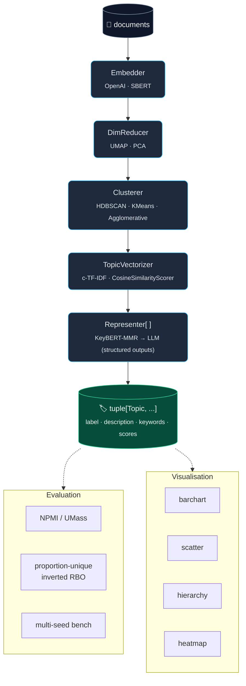

# TopicGPT

> Modular, LLM-driven topic modelling for Python.
> `embed → reduce → cluster → vectorize → represent → label`

[](https://www.python.org/)
[](#)
[](#development)
[](#development)
[](#development)
[](./LICENSE)

Traditional topic models hand you a flat list of words: `["lion", "leopard", "rhino", "elephant"]`.
TopicGPT hands you **named, described, structured topics**, computed via a fully pluggable pipeline and labelled by an LLM with Pydantic-validated outputs.

Defaults to `text-embedding-3-small` for embeddings and `gpt-5.4-mini` for labelling — cheap, fast, swappable.

---

## Install

```bash
# with uv (recommended)
uv add topicgpt

# or with pip
pip install topicgpt
```

Set your API key:

```bash
export OPENAI_API_KEY=sk-...
```

---

## Quickstart

### 30-second example

```python
from topicgpt import (
    CTFIDFVectorizer,
    HDBSCANClusterer, HDBSCANConfig,
    KeyBERTRepresenter,
    LLMRepresenter,
    OpenAIEmbedder,
    TopicModel,
    UMAPReducer,
)

documents = [
    "Lions hunt in prides on the savanna.",
    "Tigers are solitary apex predators in Asian forests.",
    "Climate change is melting Arctic sea ice at record pace.",
    "Carbon emissions and global warming threaten coral reefs.",
    "Quantum computers exploit superposition for certain speedups.",
    "Neural networks have transformed machine learning.",
    # ... your docs here
]

model = TopicModel(
    embedder=OpenAIEmbedder(),                          # text-embedding-3-small
    reducer=UMAPReducer(),                              # 5d, cosine, 15 nbrs
    clusterer=HDBSCANClusterer(HDBSCANConfig(min_cluster_size=2)),
    vectorizer=CTFIDFVectorizer(),                      # class-based TF-IDF
    representers=[KeyBERTRepresenter(), LLMRepresenter()],  # gpt-5.4-mini labels
)

model.fit(documents)

print(model.get_topic_info())
# topic_id   label                size   keywords
# 0          Big cats              2     lion, tiger, prides, solitary, ...
# 1          Climate & oceans      2     climate, carbon, warming, reefs, ...
# 2          Computing & AI        2     quantum, neural, networks, superposition, ...
```

### Find topics by query

```python
for topic, score in model.find_topics("global warming", top_k=2):
    print(f"{score:+.3f}  {topic.label}  ({', '.join(topic.keywords[:4])})")
```

### Save / load

```python
model.save("./my_model")
restored = TopicModel.load("./my_model")   # embedder optional for read-only
restored.get_topic_info()
```

### Evaluate

```python
from topicgpt.evaluation import npmi, proportion_unique_words, inverted_rbo

topic_words = [list(t.keywords[:10]) for t in model.topics_]
print("NPMI     :", npmi(documents, topic_words))
print("Diversity:", proportion_unique_words(topic_words))
print("RBO div  :", inverted_rbo(topic_words))
```

### Visualise

```python
from topicgpt.visualize import visualize_barchart, visualize_hierarchy

visualize_barchart(model).write_html("barchart.html")
visualize_hierarchy(model).write_html("tree.html")
```

### Use the CLI

```bash
topicgpt fit  --input docs.txt --out ./model --n-topics 20
topicgpt info ./model
topicgpt eval ./model --docs docs.txt --top-n 10
topicgpt viz  ./model --out chart.html --kind barchart
```

---

## What's inside



Every stage is a Protocol — write your own and pass it in.

---

## Feature matrix

| | TopicGPT v1.0 |
|---|:---:|
| Modular pipeline (swap any stage) | ✅ |
| OpenAI structured outputs (Pydantic schemas) | ✅ |
| BERTopic-style c-TF-IDF | ✅ |
| KeyBERT-MMR keyword diversity | ✅ |
| Hierarchical + reduced topic views | ✅ |
| Save/load with `joblib` | ✅ |
| Coherence eval (NPMI, UMass) | ✅ |
| Diversity eval (proportion-unique, inverted RBO) | ✅ |
| Multi-seed OCTIS-style bench harness | ✅ |
| Plotly visualisations | ✅ |
| Typed CLI (`topicgpt fit/info/eval/viz`) | ✅ |
| `mypy --strict` clean | ✅ |
| Bandit clean | ✅ |
| 140 tests, 95% coverage | ✅ |

---

## Configuration knobs

All configs are frozen Pydantic models — typo-proof, validated, immutable:

```python
from topicgpt import (
    OpenAIEmbeddingConfig, UMAPConfig, HDBSCANConfig,
    KeyBERTRepresentationConfig, LLMRepresentationConfig,
)

embedder = OpenAIEmbedder(
    OpenAIEmbeddingConfig(
        model="text-embedding-3-large",   # bump from default 3-small
        dimensions=1024,                  # truncate output
        batch_size=512,
    ),
)
```

Process-wide settings (API key, retries, cache dir) come from env via `pydantic-settings`:

```bash
export OPENAI_API_KEY=sk-...
export TOPICGPT_CACHE_DIR=.topicgpt_cache
export TOPICGPT_MAX_RETRIES=4
export TOPICGPT_REQUEST_TIMEOUT_S=60
```

---

## Migrating from 0.0.6

| 0.0.6 | 1.0 |
|---|---|
| `TopicGPT(openai_api_key=..., n_topics=20, ...)` | `TopicModel(embedder=..., reducer=..., clusterer=..., ...)` |
| `Clustering_and_DimRed` | `UMAPReducer` + `HDBSCANClusterer` (split) |
| `TopwordEnhancement` (gpt-3.5, free text) | `LLMRepresenter` (gpt-5.4-mini, structured outputs) |
| `TopicPrompting` (legacy function-calling) | Removed — call OpenAI directly with topic context |
| `tm.print_topics()` | `print(tm.get_topic_info().to_string(index=False))` |
| `tm.prompt(query)` | `tm.find_topics(query, top_k=...)` |

Old code is preserved verbatim under [`legacy/src/`](./legacy/src/) for reference.

---

## Development

```bash
uv sync --all-extras --group dev
uv run ruff check .
uv run ruff format --check .
uv run mypy src/topicgpt
uv run bandit -c pyproject.toml -r src/topicgpt
uv run pytest
```

Coverage gate: 80% (enforced in `pyproject.toml`). Current: **95.21%**.

---

## References

- BERTopic — https://maartengr.github.io/BERTopic/
- TopicGPT (Pham et al., 2024) — https://arxiv.org/abs/2311.01449
- Original (Reuter et al.) — https://github.com/ArikReuter/TopicGPT
- KeyBERT — https://github.com/MaartenGr/KeyBERT
- OpenAI Responses API (structured outputs) — https://platform.openai.com/docs/guides/structured-outputs

---

## License

MIT.
